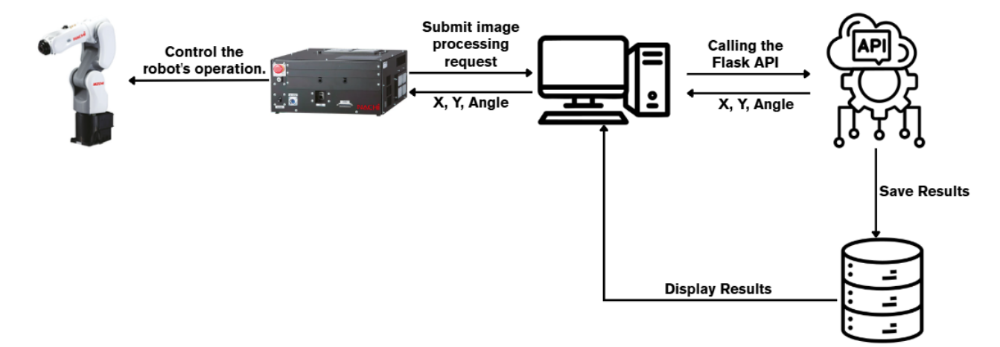
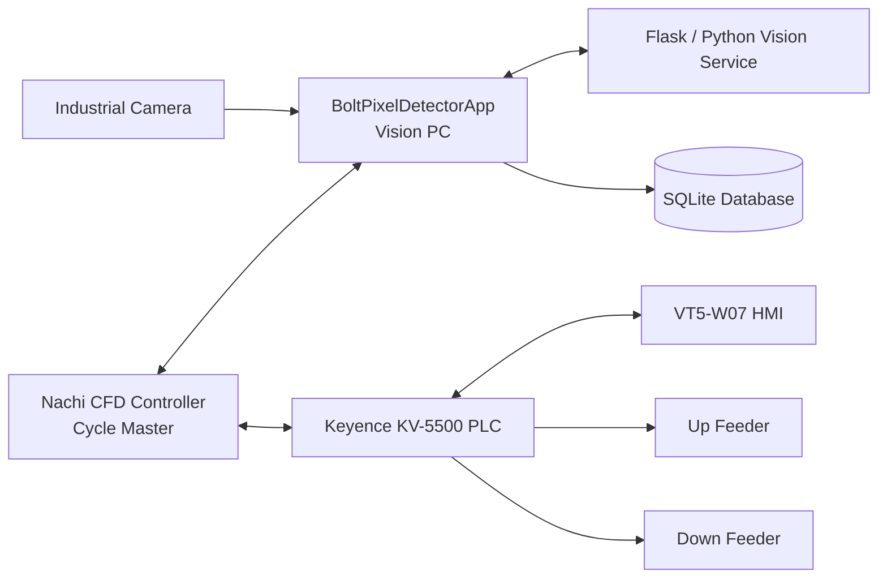
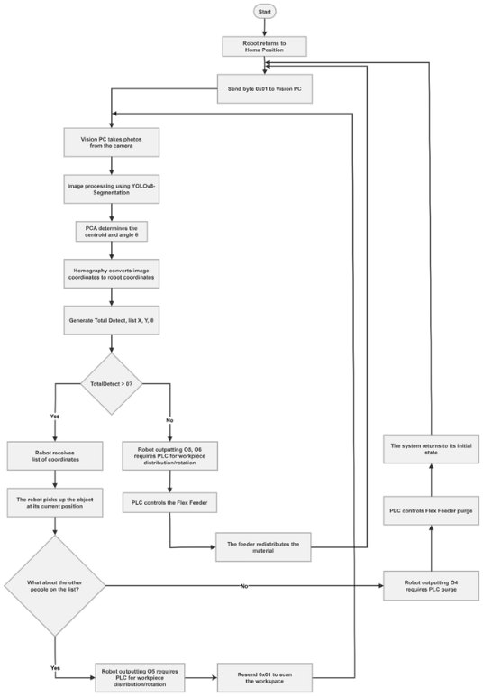
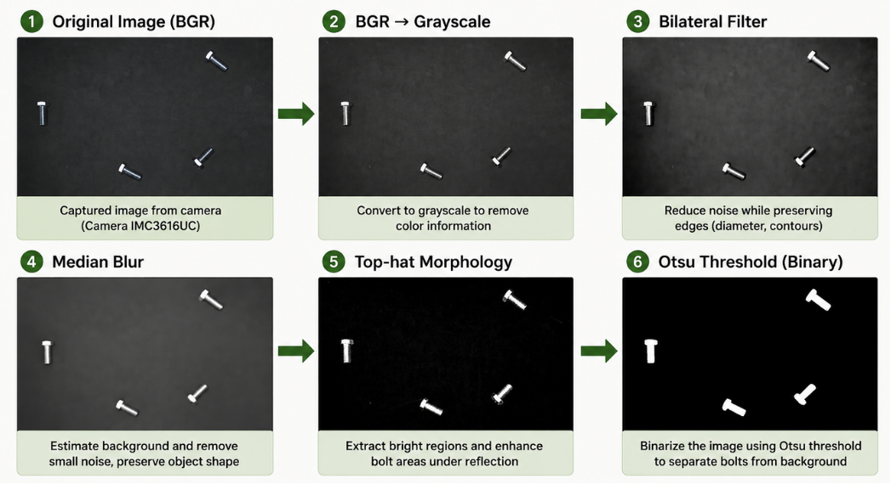
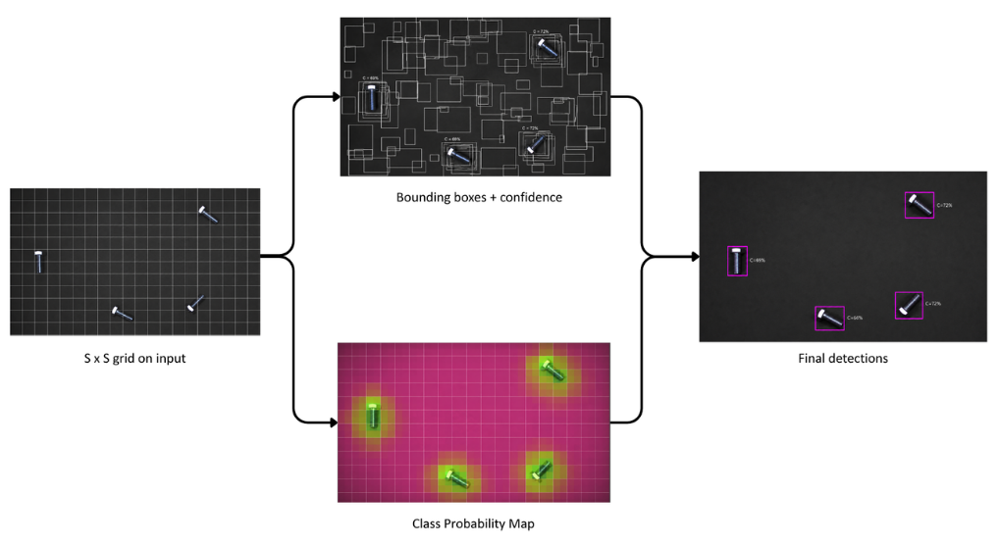

# AUTOMATED BOLT SORTING SYSTEM USING FLEX FEEDER AND ROBOTIC MANIPULATOR

## Project Overview

This repository contains the software, PLC assets, robot programs, HMI assets, and documentation for the capstone project **Research and Implementation of an Automated Bolt Sorting System using Flex Feeder and Robotic Manipulator**.

The system is designed to detect and pick **M8×15 mm target bolts** from a mixed feeder tray, estimate each bolt's center and orientation, and return pick-ready coordinates to the robot. In the documented system architecture, the **Nachi CFD controller is the Cycle Master**, the **Vision PC** performs image inspection and coordinate generation, the **Keyence KV-5500 PLC** controls feeder-side machine states, and the **VT5-W07 HMI** provides operator interaction through Ethernet TCP/IP.

---

## Repository Structure

### 1. `BoltPixelDetectorApp/`

Main Windows desktop application running on the Vision PC.

Responsibilities:

- Acquire images from the industrial camera.
- Run classical OpenCV preprocessing and contour-based bolt detection.
- Run YOLO-based instance segmentation.
- Filter invalid or unstable detections before robot dispatch.
- Convert image/camera coordinates to robot workspace coordinates.
- Coordinate data exchange with the robot controller, database, and Python vision services.

Important source files:

- `MainForm.cs`: main user interface, orchestration, and runtime state management.
- `Program.cs`: WinForms application entry point.
- `BoltDetector.cs`: classical image preprocessing and geometry extraction.
- `YoloSegmentationDetector.cs`: YOLO inference, mask handling, and OpenCV fusion logic.
- `DetectionResult.cs`, `DetectionGeometry.cs`, `CoordinateMapper.cs`: detection data modeling, geometry processing, and coordinate transformation.
- `RobotComms.cs`, `RobotConnectionSettings.cs`, `RobotRequestMonitor.cs`: TCP communication and request tracking for the robot.
- `FlaskApiClient.cs`, `flask_api_server.py`, `YoloSegmentationBridge.py`: Python vision-service integration.
- `VisionDatabase.cs`, `VisionSettings.cs`, `SystemConfig.cs`: runtime settings and data persistence.

### 2. `PLC_Keyence/`

Keyence PLC project for feeder control and machine-side sequence coordination.

It includes logic and project data for:

- Feeder start/stop control.
- Machine sequencing.
- I/O mapping and handshaking.
- Robot synchronization signals.
- System initialization and operating states.

The feeder-side logic includes the **Up Feeder** and **Down Feeder** operating sequences used for component spreading and purge operations.

### 3. `Robot_Nachi/`

Nachi robot program assets.

These files are used to:

- Receive pick coordinates and orientation data from `BoltPixelDetectorApp`.
- Execute pick-and-place motion.
- Synchronize with the PLC and Vision PC.
- Handle robot-side cycle and operating logic.

### 4. `docs/`

Project documentation and explanatory diagrams.

- `docs/report/capstone-report.pdf`: full capstone report describing the system design, implementation, integration, experimental evaluation, and results.
- `docs/images/`: communication, operation workflow, OpenCV, and YOLO theory diagrams.

### 5. Communication Architecture Diagram

`docs/images/communication-architecture.png` is a communication / payload diagram showing the data exchanged between the system components. It should be read together with the system architecture and workflow sections below.

### 6. `models/`

ONNX models used by the vision application. The project copies these models into the application output directory during build.

---

## System Architecture

The system follows a hierarchical control architecture consisting of the Vision PC, the Keyence KV-5500 PLC, the Nachi MZ04 robot controller, the Flex Feeder, and the VT5-W07 HMI.

The **Nachi CFD controller acts as the Cycle Master** and coordinates the recognition, picking, feeding, and purge sequence. The Vision PC runs `BoltPixelDetectorApp`, which performs image acquisition, machine vision processing, object filtering, coordinate transformation, and result transmission. The Keyence KV-5500 PLC controls the Flex Feeder and machine-side I/O operations. The VT5-W07 HMI provides operator monitoring and parameter configuration.

### High-Level Architecture





### Communication Summary

- **Vision PC ↔ Nachi CFD controller:** TCP Socket communication.
- **Nachi CFD controller ↔ Keyence KV-5500 PLC:** machine-side coordination and I/O exchange for feeder-related operations.
- **PLC ↔ VT5-W07 HMI:** Ethernet TCP/IP.
- **PLC → Flex Feeder:** feeder control and machine-side actions.
- **Vision PC → SQLite database:** result persistence and runtime logging.
- **Vision PC ↔ Python vision service:** local API/service communication used by the application for the supported Python inference path.

The communication diagram describes the exchanged data, while the control architecture describes the responsibility of each subsystem.

---

## Cycle Workflow

The operating cycle is controlled by the robot and branches according to the returned `TotalDetect` value.



The flowchart is a theoretical overview of the complete robot-driven cycle. The detailed implementation is described in the stages below, including vision inspection, robot picking, feeder redistribution, and purge control.

### Stage 1: Robot Requests Vision Inspection

When the system is running in automatic mode, the Nachi CFD controller acts as the Cycle Master and operates as the TCP Socket Client.

The robot sends the detection request:

```text
0x01
```

The request instructs the Vision PC to acquire an image and execute the configured machine vision pipeline.

### Stage 2: Vision PC Performs Inspection

The Vision PC runs the following vision pipeline:

```text
Camera
  ↓
Image Processing
  ↓
YOLOv8-Segmentation
  ↓
Geometric Processing
  ↓
PCA
  ↓
Coordinate Generation
```

The resulting target-bolt data includes pick-ready coordinates and orientation information. The WinForms application then returns the processed results to the robot through the TCP Socket interface.

### Stage 3: Robot Evaluates `TotalDetect`

The robot checks the number of valid detected objects.

- **`TotalDetect = 0`**: the robot requests the Keyence PLC to perform the configured feeder operation, such as component feeding or flipping, and then returns to the vision inspection stage.
- **`TotalDetect > 0`**: the robot loads the returned coordinate list and sequentially executes the corresponding pick-and-place motions.

### Stage 4: Cycle Completion and Purge

After the current coordinate list has been completed:

```text
Robot → PLC → Purge Mode → Down Feeder
```

The PLC activates the Down Feeder purge sequence to clear remaining components from the workspace. After the purge operation is completed, the system returns to Stage 1 and starts the next cycle.

This closed-loop workflow separates vision processing, machine-side feeder control, and robot motion execution while keeping the robot in charge of the overall cycle sequence.

---

## Vision Pipeline

The vision system combines classical OpenCV processing with YOLO-based instance segmentation. The two approaches are used together with geometric post-processing to obtain object masks, position information, and orientation estimates required for robotic picking.

### Classical OpenCV Preprocessing

`BoltDetector.cs` implements the preprocessing stack used before contour analysis:



The diagram summarizes the theoretical core of the pre-processing pipeline: BGR-to-grayscale conversion, edge-preserving noise reduction, background estimation, top-hat extraction of bright regions, and binary or Otsu thresholding. Its purpose is to stabilize bolt boundaries under metallic reflection conditions. The actual implementation continues with additional filters, enhancement, morphology, ROI handling, and contour processing listed below.

- BGR-to-grayscale conversion.
- `BilateralFilter` to suppress noise while preserving edges.
- `MedianBlur` to reduce texture and small local artifacts.
- Background normalization and contrast flattening.
- `TopHat` morphology to emphasize small bright structures against a non-uniform background.
- Weighted blending of the flattened image and the top-hat image.
- CLAHE for local contrast enhancement.
- Gaussian blur followed by unsharp-style enhancement.
- Otsu thresholding or fixed thresholding depending on the configured path.
- Morphological opening/closing to remove small defects and close gaps.
- Optional ROI masking to limit processing to a selected region.

After preprocessing, the application extracts contours and computes geometric descriptors such as convex hulls, minimum-area rectangles, area, circularity, and orientation. PCA can then be used to refine the principal orientation, and template matching is available where required by the configured detection path.

### YOLO Instance Segmentation

`YoloSegmentationDetector.cs` uses **YOLO instance segmentation**, not only bounding-box detection.



At the theoretical level, YOLOv8-Segmentation produces the object position, class label, pixel-level mask, and confidence score. The mask supports size filtering and target-object isolation, while `MinAreaRect` provides the smallest rotated rectangle enclosing the mask region. The project uses mAP >= 0.90 and inference latency <= 40 ms as development targets; measured experimental results should be reported separately.

The application supports two inference paths.

#### ONNX Path

- The model is loaded through OpenCV DNN.
- The image is letterboxed to the configured network input size.
- The frame is converted to a blob using `1/255.0` normalization and `swapRB=true`.
- The forward pass returns detection data and, when available, mask prototypes.
- Predictions are parsed into candidate boxes and mask coefficients.
- Non-maximum suppression is applied.
- Segmentation contours are reconstructed from the generated masks.

#### PT Path

- The application calls `YoloSegmentationBridge.py`.
- The Python bridge uses `ultralytics.YOLO`.
- Inference runs with `retina_masks=True` to preserve finer segmentation boundaries.
- The bridge returns JSON containing confidence values, bounding boxes, and polygon points.
- The C# side converts the returned polygons into contours and continues the common geometry pipeline.

### Fusion Logic

YOLO output can be fused with the classical OpenCV binary mask. The fusion step can improve geometric consistency when the segmentation mask or classical contour alone does not provide a sufficiently stable representation.

Typical cases include:

- A neural mask is slightly loose.
- Two bolts are touching.
- The detected center or orientation needs additional stability.
- The geometry should incorporate both the instance mask and the classical shape representation.

The resulting contour can be used to derive:

- Center point.
- Principal orientation axis.
- Rotated bounding box.
- Pixel area.
- Geometric parameters required for robotic picking.

### Orientation Estimation

The principal orientation of the segmented target is estimated using **Principal Component Analysis (PCA)**. The segmentation mask provides the pixel distribution used to determine the dominant axis of the bolt.

### Coordinate Transformation

The object centroid is transformed from image coordinates to the robot workspace coordinate system using **Homography calibration**. The calibrated mapping is based on corresponding camera and robot points collected on the planar picking workspace.

---

## Robot Communication

`RobotComms.cs` implements TCP Socket communication between the Vision PC and the Nachi CFD controller.

In the documented system architecture:

- The WinForms application on the Vision PC hosts the **TCP Socket Server**.
- The Nachi CFD controller operates as the **TCP Socket Client**.
- The robot sends a detection request to the Vision PC.
- The Vision PC captures an image, executes the configured vision-processing pipeline, and generates pick coordinates.
- The processed coordinates and orientation data are returned to the robot for execution.
- Request monitoring, result queuing, handshake timing, and communication status are handled by the communication layer.

The robot receives only detections that pass the configured validity, size, and robot-picking constraints.

### Vision-Service Integration

Within the Vision PC application, the WinForms layer can invoke the Flask-based vision service for the supported Python inference path. The application passes the required parameters and image data to the service, receives the processed result, and then packages the coordinate and orientation information for the robot communication layer.

This keeps the robot-facing interface independent from the internal vision-processing implementation.

---

## PLC and Flex Feeder Control

The `PLC_Keyence/` project is responsible for machine-side feeder control and sequencing.

The PLC handles:

- Feeder start/stop and operating state.
- Vibration-tray or feeder control.
- Synchronization with the robot cycle.
- I/O and machine-signal coordination.
- Automatic sequence flow around the picking process.

### Spreading Mode

The spreading sequence uses the **Up Feeder** and **Down Feeder** to redistribute parts across the vibrating tray when the current arrangement is unsuitable for vision inspection.

The Up Feeder performs the programmed vibration sequence, while the Down Feeder moves through its programmed positions to assist with redistribution. Timers, Home sensors, status registers, and internal control flags are used to sequence the operation.

### Purge Mode

After the current picking sequence is completed, the robot can request a purge operation. The PLC then activates the **Down Feeder** to move to the discharge position and clear residual components from the workspace before the next inspection cycle.

---

## HMI Role

The `VT5-W07 HMI` is part of the documented control architecture and provides operator interaction with the PLC through Ethernet TCP/IP.

The HMI supports:

- Real-time system and feeder-status monitoring.
- Operational parameter configuration.
- Machine sequence tracking.
- Alarm and fault indication.
- Interaction with PLC-controlled operating states.

---

## Main Technologies

- **.NET 8 WinForms**
- **OpenCvSharp**
- **System.Data.SQLite**
- **Python / Flask** bridge for the supported vision-service path
- **Ultralytics YOLO** for the `.pt` inference path
- **OpenCV DNN** for the `.onnx` inference path
- **Keyence KV-5500 PLC**
- **Nachi MZ04 industrial robot**
- **VT5-W07 HMI**

---

## Running the PC Application

### Minimum Requirements

- Windows
- .NET 8 SDK or runtime
- Python environment when the `.pt` YOLO bridge path is used
- Required project dependencies and camera/robot communication configuration

### Start the Application

Open `BoltPixelDetectorApp.csproj` in Visual Studio or VS Code and start the WinForms application as a normal .NET desktop project.

Before running the complete system, verify the relevant camera, network, robot, PLC, and Python-service configuration required by the deployment environment.

---

## Repository Notes

- Keep the repository organized around the three main software/control domains: `BoltPixelDetectorApp`, `PLC_Keyence`, and `Robot_Nachi`.
- Keep the capstone report under `docs/report/` for project traceability and documentation completeness.
- Keep explanatory diagrams under `docs/images/` so documentation assets remain separate from source code.
- Keep ONNX models under `models/`; do not place them in `bin/` or `obj/`.
- Keep the `exports/` folder separate from the core source code because it contains generated test and runtime outputs.

---

## Project Documentation

For the complete theoretical background, hardware description, system architecture, implementation details, communication design, experimental evaluation, and conclusions, refer to:

`docs/report/capstone-report.pdf`

---

## Project Objective

The implemented system focuses on detecting and picking **M8×15 mm target bolts** from a cluttered feeder tray containing other fasteners and mechanical components. The system combines flexible feeding, machine vision, coordinate transformation, industrial communication, and robotic manipulation into a single automated workflow.
